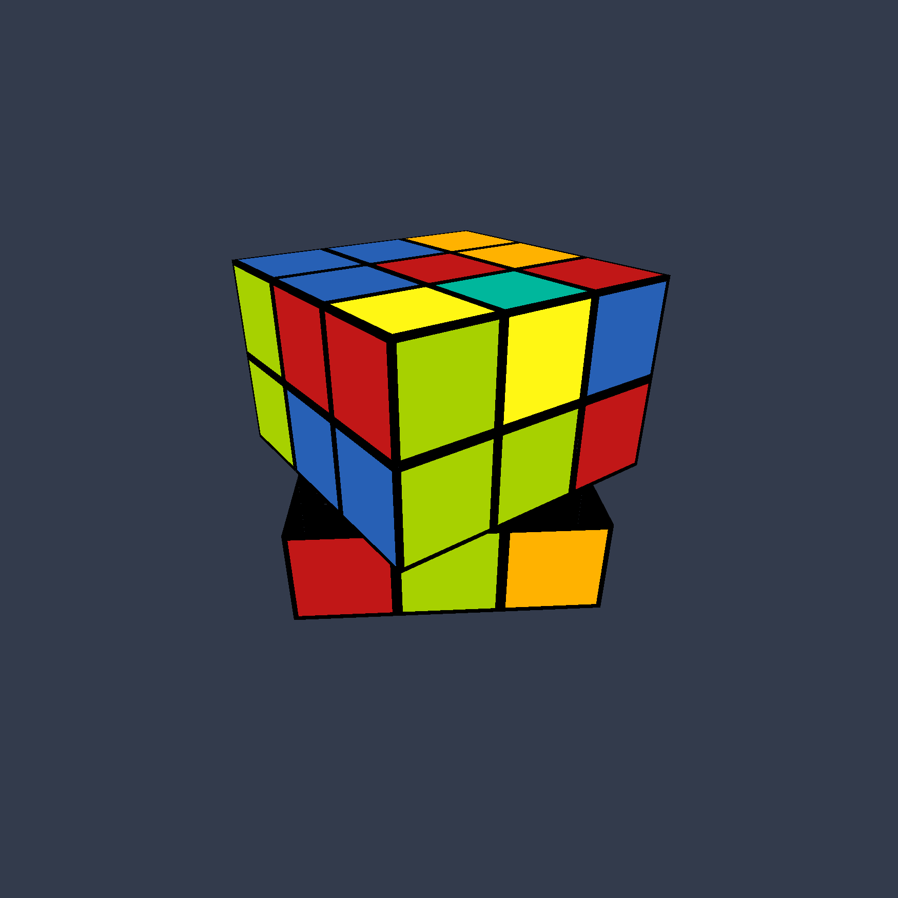

# Rubik's Solver

Solve any Rubik's cube in a quick and efficent way. By using Thisletwaite's algorithm, we can guarenty 52 moves as a maximum. Outputs both a list of moves required to solve the cube and an OpenGl rendition of the shuffled cube being solved.

## Showcase Video
[](https://www.youtube.com/watch?v=KKVDuF6clww "Thistlethwaite Rubik's Solver")

## Screenshot


## How it works


## Comiling and Running

Run `make` to compile. Needed libraries will be downloaded and an executable will be created.

Run with:
```
./Rubik "shuffle string"
```
Shuffle string should contain the different moves used to shuffle your cube,

you can use:
*R
*L
*F
*B
*D
*U

## Runtime Controls

`Mouse movement` Controls the angle/direction of the camera

`-WASD` Move camera (exact movement based on the mode below)

`-1` Glider mode (fly directions according to mouse angle)

`-2` Run mode (run on the ground with 'WASD' keys and mouse)

`-3` Classic minecraft flying mode (in addition to WASD, we have `Space` for up and `Shift` for down)

`-4` Snail mode (moves one grid per second on the ground, able to enter caves)

